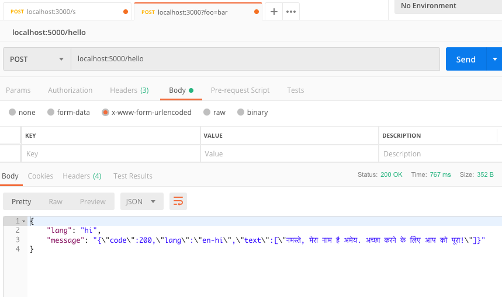
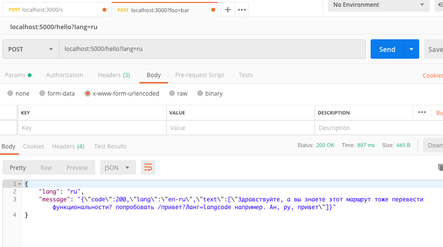

# Hello-Restful-API

## Home Assignment #1 ([Pirple's NodeJS Masterclass](https://pirple.thinkific.com/))

This is my submission project for the first assignment for the NodeJS masterclass.

### Features
1. HTTP/HTTPS support
2. NODE_ENV to toggle between debug modes
3. Modularized code
4. https POST request made to [Yandex Translation API](https://tech.yandex.com/translate/) using the default NodeJS https module
5. Every time you request /hello, it randomizes the message shown. If /hello?lang= is specified, then the Yandex API will translate it to that language.
6. Solved a previous code-structure issue by using the [Promise object](https://developer.mozilla.org/en-US/docs/Web/JavaScript/Reference/Global_Objects/Promise) to handle Async requests made to a third party.




##### P.S.
To get the translator feature to work, add the in the file ./config/private.json (The site still works without the translator, and just returns the message in English.)

```json
"yandex_api_key" : "_your_api_key_"
```

